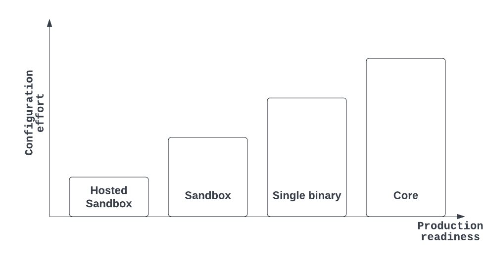

# Flyte The Hard Way 
This tutorial walks you through setting up Flyte in a semi-automated way. It includes all the manual steps you need to prepare the infrastructure before adjusting and installing a Helm chart. For a fast non-production setup, try [the Sandbox](https://docs.flyte.org/en/latest/deployment/deployment/sandbox.html).

> The steps described taken in this tutorial are not the only prescribed way to prepare the infrastructure or deploy Flyte. Feel free to contribute improvements or adapt it to your organization's policies and best practices.        

This guides takes inspiration from [Kubernetes The Hard Way](https://github.com/kelseyhightower/kubernetes-the-hard-way)
## Target audience
This tutorial is intended for platform/infrastructure engineers who plan to support a Flyte environment for production or testing.
## Flyte deployment models

- **Hosted sandbox** is available for free at [sandbox.union.ai](https://sandbox.union.ai) for a maximum of 4 hours. It includes a VS Code environment, Jupyter notebook and UI ready to get a quick feel of the platform.
- **Sandbox** deploys a local, minimal Flyte backend via a single command. It includes core services, but it doesn’t scale and supports only the necessary extensions to expose the core Flyte functionality.
- **Single binary** bundles console, admin, data-catalog and propeller services within a single binary that can be deployed to a production K8s environment or to a local test setup such as minikube. It uses a single Helm chart to reduce startup times and simplify deployment.
- **Core** is the fully fledged deployment with complete control over the configuration of each Flyte component, including production-grade features like federated authentication and Ingress networking.
 

## Introduction
Flyte is a flexible and robust platform to develop and deploy machine learning workloads in a cloud-native environment. It facilitates interaction with the underlying Kubernetes infrastructure for users who are not entirely familiar with it.

To make Flyte work (especially for deployment), you’ll need to prepare the infrastructure layer.   

While the [official documentation](https://docs.flyte.org/en/latest/deployment/deployment/cloud_simple.html) covers the general process to deploy the single binary version, this tutorial aims to supplement docs with guidance to prepare the AWS environment for a successful installation of Flyte.
For the purposes of this basic tutorial, I adhered to these principles:

- Keep all Flyte components in the same VPC
- Use default permissions when needed. More fine-grained access control can be defined and implemented by each organization
- Tag resources in accordance with your DevOps policies
- Deploy no SSL or Ingress. Follow parts 2 and 3 of this series to add those features 

This tutorial will deploy Flyte single binary to an EKS environment, progressively adding features to reach a production-ready setup.

- Part I: Simple deployment without SSL, Ingress or authentication
    - Lab 1: [Configuring permissions on AWS](./docs/01-eks-permissions.md)
    - Lab 2: [Deploying an EKS cluster](./docs/02-deploying-eks-cluster.md)
    - Lab 3: [Configure roles and service accounts](./docs/03-roles-service-accounts.md)
    - Lab 4: [create a relational database](./docs/04-create-database.md)
    - Lab 5: [SSL certificate](./docs/05-SSL-certificates.md)
    - Lab 6: [Deploy with Helm](./docs/06-deploy-with-helm.md) 
- Part II: Scalable networking with Ingress (coming soon)
- Part III: Securing the stack with certificates and authentication (coming soon)

