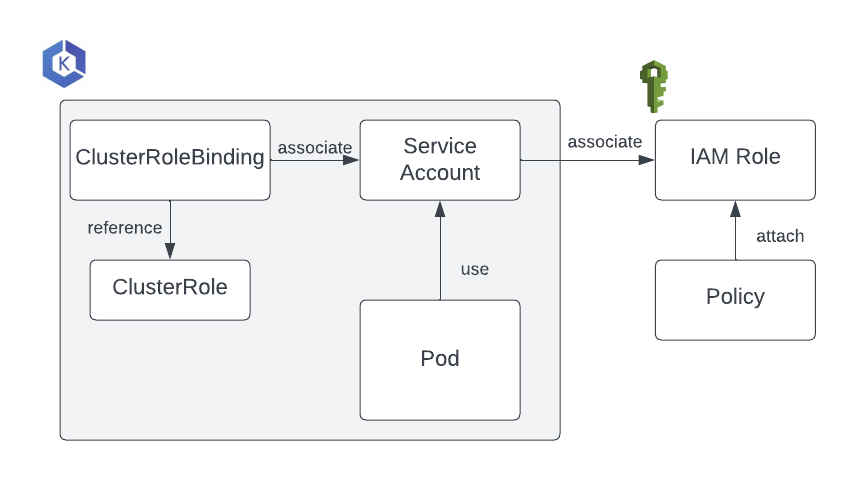

# Configure roles and service accounts

In order to restrict what Flyte components are entitled to do in an AWS environment, this guide leverages the integration between Service Accounts and IAM Roles. In this way, Flyte’s control plane components and data plane Pods (where the actual workflows run) will use Kubernetes service accounts associated with a set of permissions defined in the IAM Role. Any changes in the scope of permissions or policies in the IAM Role, will be inherited by the Kubernetes resources providing centralized control over Authorization:



## Create IAM Role

Create the `flyte-system` IAM role, attach the `AmazonS3FullAccessservice` policy to it and associate the role with a new Kubernetes service account:

```bash
eksctl create iamserviceaccount --name <my-flyte-sa> --namespace flyte --cluster <my-eks-cluster> --region <region-code> --role-name flyte-system-role \ --attach-policy-arn arn:aws:iam::aws:policy/AmazonS3FullAccess --approve
```
Where
- `<my-flyte-sa>` is the name of the service account to be created in the EKS cluster. Pick a descriptive name
- `<my-eks-cluster>` is the name of the EKS cluster you created in Section 2
- `flyte-system-role` is the recommended name for the IAM role to be created
 

2. Verify that the trust relationship between the IAM role and the OIDC provider has been created correctly:
```bash
aws iam get-role --role-name flyte-system-role --query Role.AssumeRolePolicyDocument
```
Example output:
```json
{
    "Version": "2012-10-17",
    "Statement": [
        {
            "Effect": "Allow",
            "Principal": {
                "Federated": "arn:aws:iam::442400327471:oidc-provider/oidc.eks.<region-code>.amazonaws.com/id/<UUID-OIDC>"
            },
            "Action": "sts:AssumeRoleWithWebIdentity",
            "Condition": {
                "StringEquals": {
                    "oidc.eks.us-east-1.amazonaws.com/id/<UUID-OIDC>:sub": "system:serviceaccount:flyte:<my-flyte-sa>",
                    "oidc.eks.<region-code>.amazonaws.com/id/<UUID-OIDC>:aud": "sts.amazonaws.com"
                }
            }
        }
    ]
}
```

5. Verify the Service Account has been annotated to include the IAM Role ARN:
```bash
$ kubectl describe sa <my-flyte-sa>  -n 
flyte       

Name:                <my-flyte-sa>
Namespace:           flyte
Labels:              app.kubernetes.io/managed-by=eksctl
Annotations:         eks.amazonaws.com/role-arn: arn:aws:iam::<aws-account-id>:role/flyte-system-role
Image pull secrets:  <none>
Mountable secrets:   <none>
Tokens:              <none>
Events:              <none>
```
---
Next: [Create a relational database](04-create-database.md)